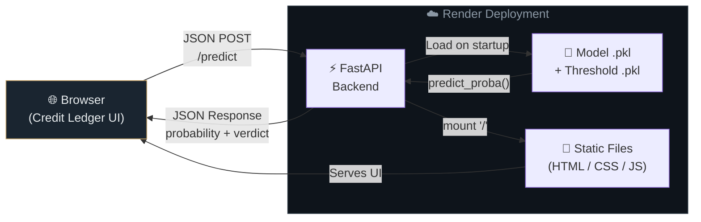

<p align="center">
  
  
  
  
  
  
</p>

<h1 align="center">Credit Ledger</h1>
<p align="center">
  <strong>Explainable Credit Risk Assessment using SHAP</strong><br/>
  <em>An end-to-end ML pipeline that predicts loan default risk — and explains why.</em>
</p>

---

## 🎯 About

Lending institutions need fast, reliable, and **transparent** decisions on loan applications. This project delivers all three:

1. **Trains & tunes** an XGBoost classifier on consumer-loan data  
2. **Explains** every prediction with SHAP (SHapley Additive exPlanations)  
3. **Serves** the model through a FastAPI backend with a sleek browser-based underwriting interface — **Credit Ledger**

> **Why explainability?** — Regulators and stakeholders increasingly demand to know *why* a model flags an applicant. SHAP provides mathematically grounded, per-feature explanations for every single prediction.

---

## ✨ Key Features

| Category | Highlights |
|:--|:--|
| **Machine Learning** | XGBoost vs Logistic Regression comparison · Stratified 5-fold CV · `RandomizedSearchCV` hyperparameter tuning · Class imbalance handling via scale weights |
| **Threshold & Calibration** | Optimal classification threshold search (not just 0.5) · Probability calibration with `CalibratedClassifierCV` |
| **Explainability** | SHAP global feature importance · SHAP local waterfall plots · False positive / false negative error analysis |
| **Production API** | FastAPI REST endpoint with Pydantic schema validation · Model served via `joblib` |
| **Frontend** | Responsive dark-themed UI · Animated risk gauge · Verdict stamp ("LOW RISK" / "HIGH RISK") · Auto-calculated loan-to-income ratio |
| **Deployment** | One-click deploy to Render via `render.yaml` |

---

## 🏗️ Architecture

### Training Pipeline


### Serving Pipeline



### Request Flow

```
┌─────────────────────────────────────────────────────────────────────┐
│  BROWSER                                                            │
│                                                                     │
│  ┌──────────────┐    ┌──────────────┐    ┌───────────────────────┐  │
│  │  index.html   │───▶│  script.js   │───▶│  POST /predict        │  │
│  │  (Form UI)    │    │  (Validate & │    │  { person_age: 30,    │  │
│  │              │    │   Submit)    │    │    loan_amnt: 100000, │  │
│  └──────────────┘    └──────────────┘    │    ...               }│  │
│                                          └──────────┬────────────┘  │
│         ▲                                           │               │
│         │              HTTP Response                │  HTTP Request  │
│         │                                           ▼               │
│  ┌──────┴───────────────────────────────────────────────────────┐   │
│  │  Animated Gauge · Verdict Stamp · Ledger Facts              │   │
│  │  { probability: 4.2%, threshold: 35%, result: "Low Risk" }  │   │
│  └──────────────────────────────────────────────────────────────┘   │
└─────────────────────────────────────────────────────────────────────┘
                                  │ ▲
                                  ▼ │
┌─────────────────────────────────────────────────────────────────────┐
│  FASTAPI SERVER (Uvicorn)                                           │
│                                                                     │
│  ┌────────────┐    ┌──────────────────┐    ┌─────────────────────┐ │
│  │  Pydantic   │───▶│  XGBoost Model   │───▶│  Threshold Check    │ │
│  │  Validation │    │  predict_proba() │    │  prob ≥ threshold?  │ │
│  └────────────┘    └──────────────────┘    └─────────────────────┘ │
│                            ▲                                        │
│                    ┌───────┴────────┐                               │
│                    │  Joblib .pkl   │                               │
│                    │  (loaded once) │                               │
│                    └────────────────┘                               │
└─────────────────────────────────────────────────────────────────────┘
```

---

## 🛠️ Tech Stack

```
ML & Data       →  Python · Pandas · NumPy · Scikit-learn · XGBoost · SHAP
Backend         →  FastAPI · Uvicorn · Pydantic · Joblib
Frontend        →  HTML5 · CSS3 (custom design tokens) · Vanilla JavaScript
Deployment      →  Render (render.yaml)
Runtime         →  Python 3.11.9
```

---

## 📁 Project Structure

```
.
├── Credit_Risk.ipynb            # Full ML pipeline notebook (EDA → SHAP)
├── credit_risk_dataset.csv      # Raw loan applicant dataset
│
├── credit_risk_model.pkl        # Serialized XGBoost pipeline
├── best_threshold.pkl           # Optimized classification threshold
│
├── main.py                      # FastAPI application entry point
├── requirements.txt             # Pinned Python dependencies
├── runtime.txt                  # Python version specification
├── render.yaml                  # Render deployment manifest
│
├── static/
│   ├── index.html               # Credit Ledger — underwriting UI
│   ├── style.css                # Dark-themed responsive stylesheet
│   └── script.js                # Form logic, gauge animation, API client
│
├── .gitignore
└── README.md
```

---

## 📊 ML Pipeline

The notebook (`Credit_Risk.ipynb`) is structured into **16 documented stages**:

| Stage | What It Does |
|:------|:-------------|
| **1. Load Data** | Import the credit risk dataset into a DataFrame |
| **2. EDA** | Distributions, target balance, missing values, outlier detection, correlation heatmap |
| **3. Data Validation** | Remove duplicates, filter impossible ages (>100) and employment lengths (>60 yrs) |
| **4. Train-Test Split** | Stratified split preserving class ratios |
| **5. Class Imbalance** | Compute scale weights to up-weight the minority (default) class |
| **6. Preprocessing** | Separate `ColumnTransformer` pipelines — scaling for LR, no scaling for XGBoost |
| **7. Evaluation Helper** | Unified function: accuracy, precision, recall, F1, confusion matrix |
| **8. Cross-Validation** | 5-fold stratified CV on both model pipelines |
| **9. Baseline Model** | Logistic Regression as the benchmark |
| **10. Hyperparameter Tuning** | `RandomizedSearchCV` over XGBoost parameter space |
| **11. Model Comparison** | Side-by-side metric table of both models |
| **12. Threshold Optimization** | Sweep thresholds to balance false positives vs false negatives |
| **13. Probability Calibration** | Calibration curves + `CalibratedClassifierCV` |
| **14. SHAP Interpretation** | Global summary plot + local waterfall for individual applicants |
| **15. Error Analysis** | Deep-dive into false positives and false negatives |
| **16. Save Model** | Export model pipeline + optimal threshold as `.pkl` artifacts |

---

## 🚀 Getting Started

### Prerequisites

- **Python 3.11+**
- **pip** package manager
- **Git**

### Installation

```bash
# Clone the repository
git clone https://github.com/axkit-rajput/credit-risk-using-SHAP.git
cd credit-risk-using-SHAP

# Create and activate a virtual environment
python -m venv venv
source venv/bin/activate        # Linux / macOS
venv\Scripts\activate           # Windows

# Install dependencies
pip install -r requirements.txt
```

### Run Locally

```bash
uvicorn main:app --reload
```

Open **[http://127.0.0.1:8000](http://127.0.0.1:8000)** — the Credit Ledger UI loads automatically.

---

## 📡 API Reference

### `POST /predict`

Submit a loan application and receive a risk assessment.

<details>
<summary><strong>Request Body</strong> (click to expand)</summary>

```json
{
  "person_age": 30,
  "person_income": 600000,
  "person_home_ownership": "RENT",
  "person_emp_length": 5.0,
  "loan_intent": "PERSONAL",
  "loan_grade": "B",
  "loan_amnt": 100000,
  "loan_int_rate": 11.5,
  "loan_percent_income": 0.17,
  "cb_person_default_on_file": "N",
  "cb_person_cred_hist_length": 6
}
```

</details>

<details>
<summary><strong>Response</strong> (click to expand)</summary>

```json
{
  "default_probability": 0.042,
  "default_prediction": 0,
  "threshold": 0.35,
  "Result": "Low Risk"
}
```

</details>

#### Input Fields

| Field | Type | Description |
|:------|:-----|:------------|
| `person_age` | `int` | Applicant's age (18–100) |
| `person_income` | `float` | Annual income |
| `person_home_ownership` | `str` | `RENT` · `MORTGAGE` · `OWN` · `OTHER` |
| `person_emp_length` | `float` | Employment length (years) |
| `loan_intent` | `str` | `PERSONAL` · `EDUCATION` · `MEDICAL` · `VENTURE` · `HOMEIMPROVEMENT` · `DEBTCONSOLIDATION` |
| `loan_grade` | `str` | Grade `A` through `G` |
| `loan_amnt` | `float` | Requested loan amount |
| `loan_int_rate` | `float` | Interest rate (%) |
| `loan_percent_income` | `float` | Loan-to-income ratio (0–1) |
| `cb_person_default_on_file` | `str` | Prior default on file — `Y` / `N` |
| `cb_person_cred_hist_length` | `int` | Credit history length (years) |

---

## ☁️ Deployment

A [`render.yaml`](render.yaml) manifest is included for one-click deployment to **[Render](https://render.com)**:

1. Push the repository to GitHub  
2. Connect your Render account to the repo  
3. Render auto-detects the manifest and deploys the service  

```yaml
services:
  - type: web
    name: credit-ledger
    runtime: python
    plan: free
    buildCommand: pip install -r requirements.txt
    startCommand: uvicorn main:app --host 0.0.0.0 --port $PORT
    autoDeploy: true
```

---

## 📄 License

This project is licensed under the **ISC License** — see the [LICENSE](LICENSE) file for details.

---

<p align="center">Built with ❤️ by <a href="https://github.com/axkit-rajput">Ankit Rajput</a></p>
